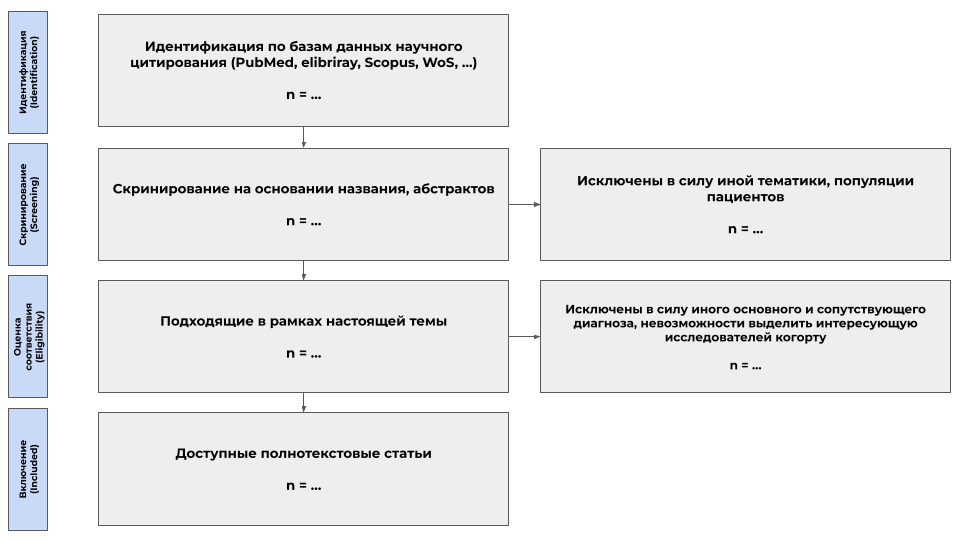
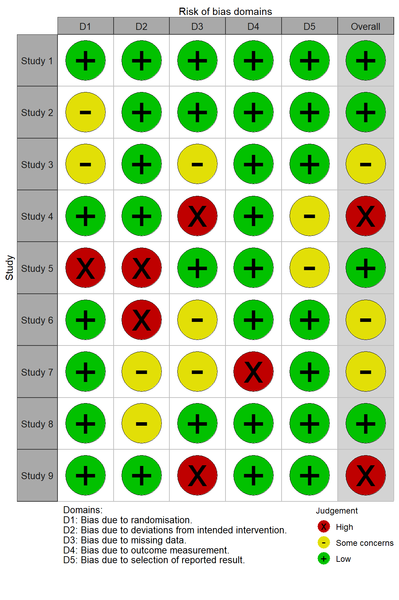
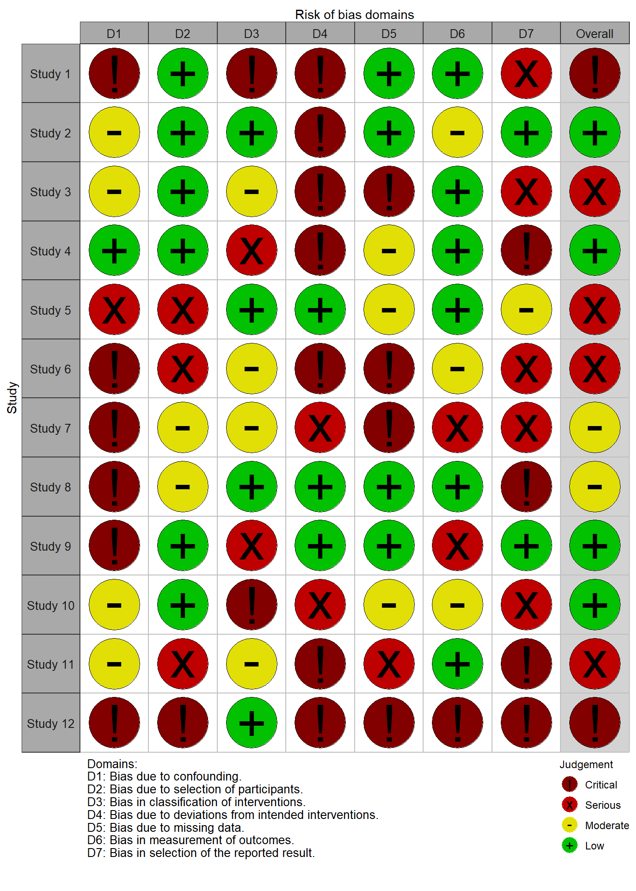
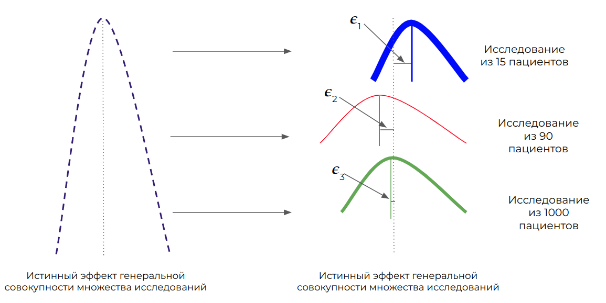
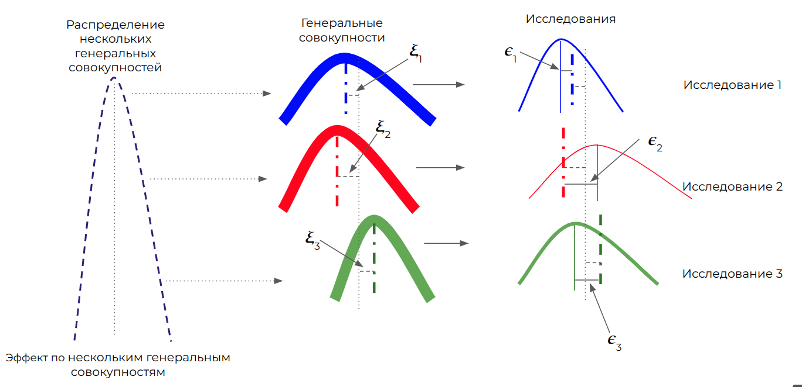
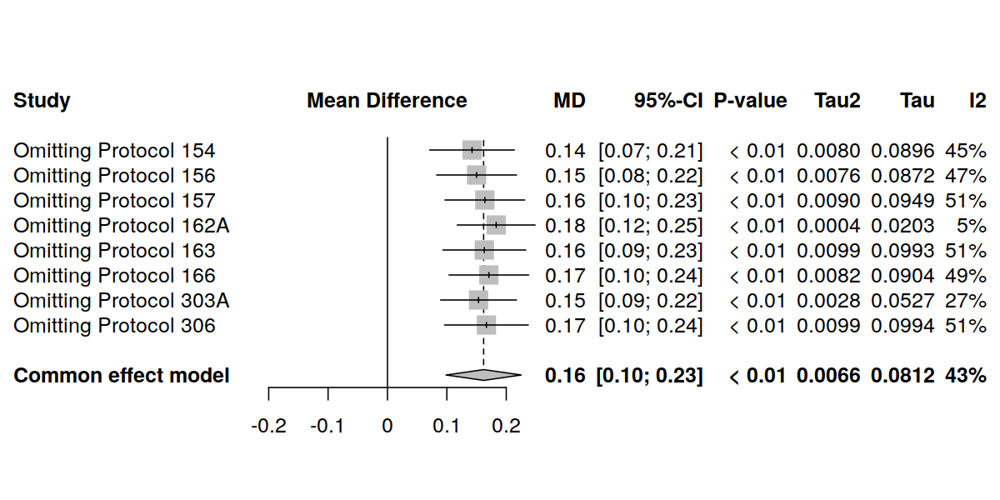
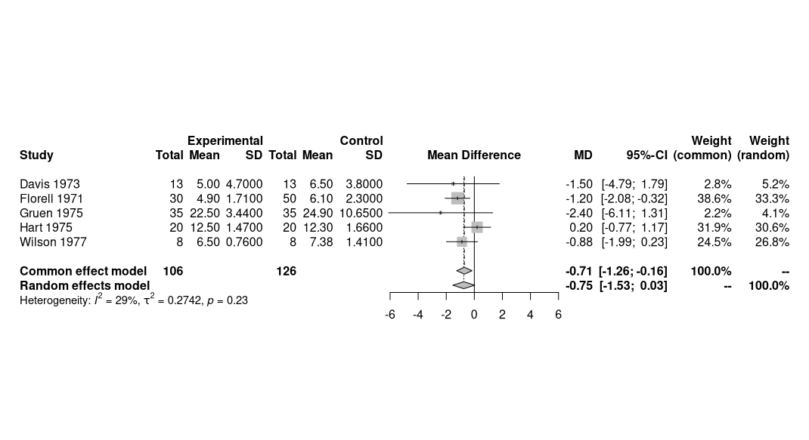

> Составитель: Суворов Александр Юрьевич

- [Базовые аспекты мета-анализов. Часть 1.](#базовые-аспекты-мета-анализов-часть-1)
    - [Авторы](#авторы)
  - [Для чего нужны мета-анализы?](#для-чего-нужны-мета-анализы)
  - [Включение исследований в мета-анализ и методологические основы](#включение-исследований-в-мета-анализ-и-методологические-основы)
    - [Рекомендации PRISMA](#рекомендации-prisma)
  - [Оценка возможных смещений в публикациях](#оценка-возможных-смещений-в-публикациях)
  - [Размер эффекта в мета-анализе](#размер-эффекта-в-мета-анализе)
    - [Модели с фиксированными и случайными эффектами](#модели-с-фиксированными-и-случайными-эффектами)
      - [Модель с фиксированными эффектами](#модель-с-фиксированными-эффектами)
      - [Модель со случайными эффектами](#модель-со-случайными-эффектами)
  - [Оценка гетерогенности](#оценка-гетерогенности)
    - [Способы оценки гетерогенности](#способы-оценки-гетерогенности)
      - [Cochran`s $Q$](#cochrans-q)
      - [$I^2$ - статистика Хиггинса и Томпсона](#i2---статистика-хиггинса-и-томпсона)
      - [$H^2$ - статистика](#h2---статистика)
      - [Дисперсия гетерогенности $\tau^2$](#дисперсия-гетерогенности-tau2)
  - [Анализ чувствительности](#анализ-чувствительности)
  - [График Forest Plot](#график-forest-plot)
- [Заключение](#заключение)
- [Ссылки](#ссылки)

**План статей - часть 1**

- [ ] Общие рекомендации
- [ ] Размер эффекта и стандартизованные показатели
- [ ] Создание взвешенных показателей и веса
- [ ] Статистические модели в мета-анализе
- [ ] Выбор модели
- [ ] Оценка гетерогенности?
- [ ] График Forest Plot

**План статей - часть 2**

- [ ] Анализ чувствительности
- [ ] Анализ подгрупп
- [ ] Мета-регрессия
- [ ] Оценка публикационного смещения

### Авторы

- Суворов А.Ю. - канд. мед. наук, главный статистик Центра анализа сложных систем Института биодизайна и моделирования сложных систем, Первый МГМУ им. И.М. Сеченова (г. Москва);
- Буланов Н.М. - канд. мед. наук, доцент кафедры внутренних, профессиональных болезней и ревматологии, Первый МГМУ им. И.М. Сеченова (г. Москва);
- Латушкина И.В. - младший научный сотрудник Центра анализа сложных систем Института биодизайна и моделирования сложных систем, Первый МГМУ им. И.М. Сеченова (г. Москва);
- Надинская М.Ю. - канд. мед. наук, доцент кафедры пропедевтики внутренних болезней, гастроэнтерологии и гепатологии, Первый МГМУ им. И.М. Сеченова (г. Москва);
- Бутнару Д.В. - канд. мед. наук, проректор по научной работе, Первый МГМУ им. И.М. Сеченова (г. Москва).

## Для чего нужны мета-анализы?

<!-- https://www.ncbi.nlm.nih.gov/pmc/articles/PMC3049418/  -->

Многие оригинальные исследования имеют сходные цели и задачи, но при этом проводятся разными коллективами, с разными пациентами, по иным протоколам и в разные временные промежутки. Результаты таких исследований могут быть разнообразны ии противоречивы, что затрудняет принятие клинических решений. Благодаря концепции доказательной медицины разработаны инструменты, позволяющие объединить результаты многочисленных исследований, в определенной мере различающихся между собой [^Sackett]. Проверяя гипотезы в разных популяциях мы получаем бесценные данные о том, что а) эффект прослеживается у разных групп (или, наоборот, есть только в конкретных группах) б) получаем информацию о вариабельности эффекта. Большое количество сходных исследований, по сути, являются репликациями одного большого эксперимента. Соответственно, большее количество репликаций повышает мощность и степень доверия к результатам.

Существуют несколько основных инструментов, чтобы вынести суждение о совокупных результатах неких единообразных исследований:

- **Систематические обзоры**. Систематические обзоры включают все исследования, которые возможно найти, соответствующие неким строгим критериям включения. Данные критерии включения направлены на соблюдение ряда стандартов, предъявляемых к планированию исследований, их проведению и стандартным операционным процедурам и результатам (например, исследования по артериальной гипертензии, где артериальное давление оценивалось в соответствии с международными рекомендациями по кардиологии; исследования определенной манипуляции в хирургии, которая выполнялась строго в соответствии с четкими рекомендациями международных ассоциаций). 

- **Мета-анализы**. Главным отличием мета-анализа от систематических обзоров является не только рассмотрение результатов ряда исследований, но и количественная оценка их результатов. В самом деле, нам необходимо знать не только то, что препарат/вмешательство обладает эффектом, но и оценить размер этого эффекта, и широту его вариабельности.

В настоящей публикации мы затронем базовые аспекты проведения мета-анализов, что делается после того, как проведен литературный поиск, и, фактически, проведена большая часть работы для систематического обзора. 

## Включение исследований в мета-анализ и методологические основы

### Рекомендации PRISMA

Детальное описание критериев и процесса литературного поиска не является темой настоящей публикации, однако важно помнить, что любое создание систематического обзора состоит из ряда ступеней. Эти ступени объединены в стандартную схему, получившую название диаграмма PRISMA, по названию соответствующих рекомендаций [^PRISMA]. 

Шаблон диаграммы PRISMA, адаптировано из Page et al.[^PRISMA]

Собственно, мета-анализ начинается после того, как завершено включение и доступны исследования, из которых будет выполнена экстракция данных. 

Основными рекомендациями по предварительным и дальнейшим шагам, представляющим для читателя практический интерес, являются:

- Руководство Кокрановского общества по составлению систематических обзоров (Cochrane Handbook for Systematic Reviews of Interventions) [^Cochrane] - данный документ размещен в интернете и представляет собой структурированное руководство с освещением практически всех аспектов литературного поиска, проведения мета-анализа, базовых навыков по математической статистике, необходимых для такой работы;

- Рекомендации PRISMA, о которых мы упоминали выше (Preferred Reporting Items for Systematic Reviews and Meta-Analyses (PRISMA)) [^PRISMA];

Представленные рекомендации помогут соблюсти высокие стандарты при написании систематических обзоров и снизить число возможных ошибок и неточностей, которые впоследствии могут затруднить продолжение работы. В связи с тем, что мета-анализы широко используются фармацевтическими компаниями, а также иными коммерческими структурами, соблюдение указанных в рекомендациях стандартов проверяется ревьюерами очень тщательно как при рассмотрении, так и при публикации статей. Строгое соблюдение регламента и рекомендаций является залогом успешной публикации. 

## Оценка возможных смещений в публикациях

После сбора всех подходящих публикаций для включения в систематический обзор или мета-анализ необходимо оценить их с точки зрения возможных смещений. К сожалению, источников потенциальных смещений может быть довольно много, поэтому были разработаны специальные инструменты, позволяющие исследователям проводить потенциальную оценку публикаций. Такие инструменты получили название *графики риска смещений* или risk of bias plots.

Данные графики можно строить для исследований с различными типами дизайна, в первую очередь, для рандомизированных контролируемых исследований (РКИ) и для нерандомизированных исследований (неРКИ) [^robvis] [^robins]. Графики, приведенные ниже, получили название "светофоры". Основная идея сводится к тому, что исследователи, проводящие мета-анализ, рассматривают каждое исследование по отдельности и оценивают, насколько велики риски, ассоциированные с:

- рандомизацией;
- вмешательством;
- пропущенными данными;
- оценкой конечной точки;
- предоставлением результатов

в РКИ. 

*- *График адаптирован из McGuinness и соавт.[^robvis_R_lib]*

В случае, если исследования не являлись РКИ оцениваются риски, связанные с:

- конфаундингом;
- отбором и включением пациентов;
- вмешательством;
- расхождением с протоколом;
- пропущенными данными;
- оценкой конечной точки;
- предоставлением результатов.

*- *График адаптирован из McGuinness и соавт.[^robvis_R_lib]*

Оценка риска интерпретируется как потенциально "низкая", "умеренная", "высокая" и "очень высокая". 

Данный инструмент позволяет критически подходить к полученным в мета-анализе результатам и рассматривать исследования с высоким риском смещения, как менее надежные. 

Детальное описание возможностей данного инструмента приведено на сайте https://www.riskofbias.info/. 

## Размер эффекта в мета-анализе

Исследования, объединенные в мета-анализе обычно оценивают результаты по идентичной конечной точке. Данная оценка есть эффект, который был достигнут, или *наблюдаемый эффект*. Эффект традиционно обозначается греческой буквой "тета" $\theta$, наблюдаемый эффект по каждому из *k* исследований обычно обозначается, как $\theta_k$. Понятие эффекта, его размера и его оценки описано в нашей публикации о тестировании статистических гипотез [^stat_test].

Существуют две основных концепции, позволяющие описать и оценить эффект нескольких исследований. Обе эти концепции привязаны к соответствующим статистическим моделям, с *фиксированными* и со *случайными* эффектами. 

### Модели с фиксированными и случайными эффектами

#### Модель с фиксированными эффектами

<!-- Иллюстрации отсюда: https://docs.google.com/presentation/d/1rAcCuietHzjIvflFLC9I8VthZ5uozTowefzN6Pd1oec/edit?usp=sharing -->

**Модель с фиксированными эффектами** подразумевает, что включенные в мета-анализ исследования очень похожи друг на друга в отношении исследователей, дизайна, количества пациентов, методологии проведения, оценки результатов и т.д. Исследования представляются сходными настолько, что их результаты, или эффекты $\theta_{1,2,3,...k}$ считают единой выборкой из одной генеральной совокупности всех возможных аналогичных исследований. 

Вероятностное распределение такой совокупности имеет математическое ожидание (среднее взвешенное по вероятностям возможных значений), представляющее собой некий *истинный размер эффекта* $\hat{\theta}$. Соответственно, каждое исследование представляет собой элемент совокупности, а несколько случайно взятых из такого распределения исследований (мета-анализ) представляют собой банальную выборку. 

Наблюдаемый эффект в каждом исследовании *k* будет отличаться от истинного на величину ошибки:

$$
\begin{equation}
\hat{\theta} = \theta_k + \epsilon_k
\end{equation}
$$

Соответственно, мы  считаем, что среди нескольких исследований наиболее точными являются те, где величина выборочной ошибки $\epsilon$ наименьшая. 

Выборка из нескольких исследований $\{1,2,3,... k\}$ должна иметь некую центральную тенденцию или математическое ожидание, отражающее истинный размер эффекта. Таким образом, используя определение математического ожидания, как среднее взвешенное, получаем:

$$
\begin{equation}
\hat{\theta} = \frac{w_1 \theta_1 + w_2 \theta_2 + w_3 \theta_1  + ... + w_k \theta_k}{w_1 + w_2  + w_3  + ... + w_k}
\end{equation}
$$

, где 

- $\hat{\theta}$ - взвешенный размер эффекта по *k* исследованиям, являющийся результатом мета-анализа;
- $\theta_k$ - наблюдаемый эффект исследования *k*;
- $w_k$ - вес исследования *k*.

Из данного уравнения неясным остается, как получить вес каждого исследования. 

Как мы знаем, наблюдаемый эффект, полученный в исследовании *k* является точечной оценкой (в англ. литературе - point estimate). В исследовании *k* включено определенное количество пациентов, *n*. Мерой вариабельности эффекта $\theta_k$ будет его стандартная ошибка, рассчитанная как:

$$
\begin{equation}
s_k = \frac{\sigma_k}{\sqrt{n}},
\end{equation}
$$
, где 

- $\sigma$ - стандартное отклонение эффекта $\theta_k$ в исследовании *k*;
- $n$ - количество пациентов в исследовании *k*.

В модели с фиксированными эффектами один из способов расчета весов выполняется с помощью т.н. метода обратной дисперсии (inverse variance method):

$$
\begin{equation}
w_k = \frac{1}{s^2_k}
\end{equation}
$$

, где 

- $s^2_k$ - квадрат стандартной ошибки эффекта $\theta_k$ в исследовании  в исследовании *k*;
- $w_k$ - вес исследования *k*.

Таким образом, в модели с фиксированными эффектами вес любого исследования обратно связан с величиной обратной ошибки эффекта в исследовании и напрямую - с количеством включенных в исследование пациентов. Допущением модели является тот факт, что ничто, кроме количества пациентов не может влиять на вес исследования. 

Данная концепция, с одной стороны, представляется излишне упрощенной. В реальном мире исследования так или иначе отличаются друг от друга, и данные различия обусловлены огромным количеством факторов помимо размера выборки. 

#### Модель со случайными эффектами

Если в мета-анализе объединены исследования различного дизайна (РКИ, когортные и т.п.), проведенные в разные годы, в разных странах, в центрах с разными стандартами оказания медицинской помощи, с протоколами интервенции по разным клиническим рекомендациям, требуется модель, которая будет учитывать не только различия по объему выборки, но и по вышеупомянутым факторам. 

Такая модель предполагает, что эффект по каждому исследованию, включенному в мета-анализ, является выборкой из собственной совокупности размеров эффекта и отличается от математического ожидания собственной совокупности на величину $\epsilon_k$. 

Если мы включили в мета-анализ *k* исследований, следовательно это *k* выборок из *k* различных генеральных совокупностей. При этом *k* совокупностей имеют свое распределение с математическим ожиданием в виде взвешенного размера эффекта, при этом каждая генеральная совокупность отличается от математического ожидания своего распределения на величину $\xi_k$. Такое общее распределение имеет точечную оценку, которая соответствует взвешенному эффекту в мета-анализе, $\hat{\theta}$, и дисперсию $\tau^2$. 

Схематично это можно представить следующим образом:

Таким образом, точечная оценка эффекта в каждом исследовании среди *k* отличается от взвешенного эффекта следующим образом:

$$
\begin{equation}
\hat{\theta} = \theta_k + \epsilon_k + \xi_k
\end{equation}
$$

Показатель $\xi_k$ объединяет различия, которые на связаны с ошибкой выборки. 

Модель, которая использует данную логику, получила название *модель со случайными эффектами*. 

Веса индивидуальных исследований в такой модели рассчитываются следующим образом:

$$
\begin{equation}
w_k = \frac{1}{s^2_k + \tau^2}
\end{equation}
$$

, где 

- $s^2_k$ - квадрат стандартной ошибки эффекта $\theta_k$ в исследовании  в исследовании *k*;
- $w_k$ - вес исследования *k*,
- $\tau^2$ - дисперсия распределения нескольких генеральных совокупностей.

В свою очередь взвешенный эффект рассчитывается абсолютно также, как и для модели с фиксированными эффектами:

$$
\begin{equation}
\hat{\theta} = \frac{w_1 \theta_1 + w_2 \theta_2 + w_3 \theta_1  + ... + w_k \theta_k}{w_1 + w_2  + w_3  + ... + w_k}
\end{equation}
$$

, где 

- $\hat{\theta}$ - взвешенный размер эффекта по *k* исследованиям, являющийся результатом мета-анализа;
- $\theta_k$ - наблюдаемый эффект исследования *k*;
- $w_k$ - вес исследования *k*.

Для вычисления показателя $\tau^2$ используются различные математические подходы, наиболее часто - DerSimonian-Laird, ограниченного максимального правдоподобия (Restricted Maximum Likelihood (REML)), максимального правдоподобия (Maximum Likelihood (ML)), процедура Paule-Mandel (PM) и другие [^methods_heterog_1], [^methods_heterog_2], [^methods_heterog_3]. Выбор конкретного метода зависит от типа оценки конечной точки и от конкретной ситуации, поэтому требует консультации с биостатистиком. 

## Оценка гетерогенности

Мы выяснили, что включенные в мета-анализ исследования могут значительно различаться, более того, в зависимости от этих различий избирается та или иная модель анализа. Существует ли некая мера, с помощью которой можно оценивать степень различий? Можем ли мы как-то объяснить степень различий и нужно ли это делать? Как определить, какие исследования больше отличаются от других?

На все эти вопросы может дать ответ концепция о *гетерогенности*. 

Гетерогенность зависит от многих причин, наиболее частые из которых:

- неверный подбор исследований для мета-анализа;
- наличие явных и скрытых *факторов-модераторов*, влияющих на взвешенный эффект (модератор фактически создает подгруппы с разным размером эффекта);
- небольшое количество исследований, используемых для в мета-анализа.

Когда исследователи сталкиваются с избыточной гетерогенностью, например, в ситуации, где у ряда исследований противоположное направление эффекта, или когда крайне разный размер эффекта, необходимо разобраться, не имеет ли место ошибочное включение исследований в мета-анализ. Попытка объединить исследования, в которых оценивались совершенно разные вещи, приведет к огромной гетерогенности и не ответит на вопрос мета-анализа. Результаты такого мета-анализа довольно крайне сомнительны. 

Если мы считаем, что на данном этапе ошибки нет, необходимо далее искать причину высокой гетерогенности. Например, при использовании нестандартизованных показателей необходимо попытаться использовать стандартизованные. Ряд показателей может быть измерен в разных шкалах или значительно различаться на включении между исследованиями - стандартизация позволяет сгладить такие различия. 

Следующей причиной высокой гетерогенности является наличие скрытых или явных модераторов или конфаундеров. Например, при оценке распространенности сердечно-сосудистых заболеваний явными модераторами являются пол и возрастная группа пациентов. Включение модератора и оценка его влияния на эффект и гетерогенность проводится с помощью *мета-регрессионного анализа или мета-регрессии*. Дальнейших анализ подгрупп позволяет значительно снизить гетерогенность. 

Наконец, малое количество исследований в мета-анализе может привести к высокой гетерогенности. 

По Rücker существует 2 основных типа гетерогенности: [^Rucker]

- **Гетерогенность, обусловленная дизайном или базовыми характеристиками**. Причиной является попытка объединить в мета-анализе различные по дизайну исследования (включая тип исследования, характер вмешательства, способ оценки результатов, срок их оценки и т.д.), а также исследования, сильно гетерогенные по когортам пациентов. Данный тип гетерогенности может приводить к *статистической гетерогенности*;
- **Статистическая гетерогенность**. Обусловлена точностью оценки и вариабельностью размера эффекта. Данную гетерогенность уже можно оценить количественно. Одной из причин (но совсем не всегда) статистической гетерогенности может быть гетерогенность, обусловленная дизайном. 

### Способы оценки гетерогенности

#### Cochran`s $Q$

Мы рассмотрели оба типа моделей и поняли, что существует наблюдаемый эффект $\hat{\theta}_k$ некоего исследования $k$, а также взвешенный эффект, который мы рассчитываем $\hat{\theta}$ для всех исследований мета-анализа. Мы также помним, что у каждого исследования есть свой вес $w_k$. Отклонение наблюдаемого эффекта от взвешенного может быть направлено в любую сторону (т.е., быть с любым знаком). Если мы возведем отклонение в квадрат, оно больше не будет привязано к направлению. 

Сумма взвешенных квадратов таких отклонений получило название Cochran’s $Q$:

$$
\begin{equation}
Q = w_1(\hat{\theta}_1 - \hat{\theta})^2 + w_2(\hat{\theta}_2 - \hat{\theta})^2 + w_1(\hat{\theta}_1 - \hat{\theta})^2 + ... + w_n(\hat{\theta}_n - \hat{\theta})^2
\end{equation}
$$

Мы можем рассчитать отклонение наблюдаемого эффекта от взвешенного по всем исследованиям.

Распределение Cochran’s $Q$ сильно приближено к распределению $\chi^2$ с $K-1$ степенями свободы, где $K$ - количество исследований в мета-анализе.

Cochran’s $Q$ будет расти при уведичении количества исследований в мета-анализе, а также при наличии в нем крупных исследований с большим количеством пациентов. 

#### $I^2$ - статистика Хиггинса и Томпсона

Данная статистика рассчитывается с помощью Cochran’s $Q$ и указывает на % гетерогенности, обусловленный ошибкой $\xi_k$ (т.е., ошибкой, не связанной с размером выборки).

нулевая гипотеза состоит в том, что гетерогенность отсутствует, и Cochran’s $Q$ следует распределению $\chi^2$ с $K-1$ степенями свободы (ожидаемая гетерогенность). Но у нас имеется и наблюдаемая гетерогенность $Q$. Тогда отклонение наблюдаемой гетерогенности от ожидаемой составляет:

$$
\begin{equation}
I^2 = \frac{Q-(K-1)}{Q}
\end{equation}
$$

и выражается в долях единицы или в процентах. 

Принято выделять низкую (до 25%), умеренную (25-75%) и высокую (75% и выше) гетерогенность [^Higgins].

#### $H^2$ - статистика

Данная статистика расчитывает отношение $Q$-статистики к $K-1$: при отсутствии гетерогенности значение стремится к 1. Более высокие значения говорят о наличии гетерогенности между исследованиями.

$$
\begin{equation}
H^2 = \frac{Q}{(K-1)}
\end{equation}
$$

#### Дисперсия гетерогенности $\tau^2$

Истинный взвешенный эффект имеет собственную дисперсию $\tau^2$ и стандартное отклонение $\tau$.

Данная статистика хорошо подходит для оценки меры гетерогенности, т.к. имеет ту же размерность, что и эффект в исследованиях в мета-анализе. Зная рассчитанный взвешенный размер эффекта $\hat{\theta}$ в мета-анализе, мы можем оценить 95% ДИ истинного эффекта, как $\hat{\theta} \pm 1,96 \times \tau$.

## Анализ чувствительности 

Анализ чувствительности показывает, какое влияние могут оказать отдельные исследования на взвешенный эффект, или, другими словами, насколько результаты мета-анализа устойчивы. 

Одним из наиболее часто используемых способов оценки чувствительности является метод leave-one-out. Каждое исследование по одному удаляется из мета-анализа, после чего размер взвешенного эффекта и гетерогенность пересчитываются. Серьезные изменения по величине размера эффекта и снижение гетерогенности указывает на то, что именно исключенное исследование оказывает существенное влияние на общий результат. Если первоначально такое исследование в графике-"светофоре" было оценено исследователями, как обладающее высоким/умеренным риском смещения, оно может быть исследованием - выбросом, и необходимо рассматривать целесообразность его присутствия в мета-анализе. 

Графически результаты анализа могут быть представлены следующим образом:

*- *График адаптирован из McGuinness и соавт.[^balduzzi]*

В данном примере взвешенный эффект, полученный в мета-анализе, является разницей средних (mean difference) и составил 0,16 [0,1; 0,23] мы видим, что при исключении поочередно исследований из мета-анализа взвешенный эффект существенно не меняется. При этом исключение исследования Protocol 162A существенно снижает гетерогенность, по статистикие $I^2$ до 5%. Данное исследование требует пристального внимания, т.к. его присутствие обуславливает высокие значения гетерогенности во всем мета-анализе. 

В общем случае, анализ чувствительности направлен на оценку того, как меняется взвешенный эффект при исключении исследований, которым при оценке потенциальных рисков смещения был присвоен "высокий" и "очень высокий" уровень риска. При возникновении существенного влияния на эффект при исключении таких исследований (например, в ситуации, когда после исключения исследований с высоким риском 95% ДИ нового взвешенного эффекта перестает включать точечную оценку взвешенного эффекта до исключения исследований) необходимо пересмотреть необходимость включения исследований с высоким риском в мета-анализ. 

## График Forest Plot

Наиболее общим способом суммировать результаты мета-анализа является т.н. **forest plot** - специфический график, отображающий исследования, вошедшие в анализ, эффект в каждом из них, взвешенный эффект, а также ряд дополнительных характеристи, например, веса каждого исследования, показатели гетерогенности, тип выбранной статистической модели (фиксированные или случайные эффекты). Неотъемлемой частью forest plot является диаграмма, дублирующая размеры эффекта и их 95% ДИ, а также взвешенный эффект и его 95% ДИ. Довольно часто размер точек на графике, характеризующих определенное исследование, связан с весом данного исследования (соответственно, точки наибольшего размера связаны с исследованиями с наибольшим весом). 

Типичный forest plot показан на рисунке ниже. Данные исследования взяты из материалов, сопровождающих библиотеку `meta` языка программирования R [^Schwarzer], [^Fleiss].

Мы видим названия исследований и год публикации результатов, характеристики основных и контрольных групп (количества, средние и стандартные отклонения - необходимые нам данные для расчета стандартной ошибки), размер эффекта (а данном случае, разница средних, mean difference (MD)) и его 95% ДИ, веса в моделях с фиксированными и случайными эффектами, взвешенный эффект для обоих типов моделей, а также показатели гетерогенности. 

Также мы видим диаграмму с отрисовкой всё тех же размеров эффекта в исследованиях (в виде квадратов, размер которых указывает на веса) и взвешенные эффекты для моделей с фиксированными и случайными эффектами (в виде ромбов). 

Вертикальная сплошная черта обозначает размер эффекта, равный 0. Т.к. мы имеем дело с разницей средних, если 95% ДИ отдельных исследований или взвешенных эффектов включает 0, значит высока вероятность, что наблюдаемые точечные оценки случайны. 

В настоящем примере единственное исследование, где наблюдается значимый эффект - Florell 1971, его вес в модели как с фиксированными, так и со случайными эффектами наивысший (38,6% и 33,3% соответственно). По результатам мета-анализа модель с фиксированными эффектами показывает наличие значимого эффекта, разница средних составила -0,71 [-1,26; -0,16], при этом результаты модели со случайными эффектами оказались незначимыми: точечная оценка составила -0,75, а 95% ДИ включает 0, [-1,53; 0,03]. 

# Заключение

В настоящей части статьи мы познакомились с этапами включения исследований в мета-анализ, рассмотрели существующие рекомендации, с которыми необходимо познакомиться при написании мета-анализа, детально разобрали процесс создания весов, различные типы моделей, используемых в мета-анализах. Также мы познакомились с понятием гетерогенности и поняли, как оно вычисляется. Были представлены основные графики, публикуемые в мета-анализах, такие как forest plot и график leave-one-out для анализа чувствительности. 

В следующей публикации мы рассмотрим, как происходит анализ подгрупп и концепцию мета-регрессии, а также научимся оценивать публикационное смещение, визуально и математическими методами. Дополнительно мы вспомним, как наиболее часто оценивается эффект в мета-анализе, и остановимся на стандартизованных показателях и оценке для них стандартной ошибки. 

----
----

# Ссылки

[^Sackett]: Sackett DL, Rosenberg WM, Gray JA, Haynes RB, Richardson WS. Evidence based medicine: what it is and what it isn't. BMJ. 1996 Jan 13;312(7023):71-2. doi: 10.1136/bmj.312.7023.71. PMID: 8555924; PMCID: PMC2349778.

[^PRISMA]: Page M J, McKenzie J E, Bossuyt P M, Boutron I, Hoffmann T C, Mulrow C D et al. The PRISMA 2020 statement: an updated guideline for reporting systematic reviews BMJ 2021; 372 :n71 doi:10.1136/bmj.n71 http://www.prisma-statement.org/

[^stat_test]:  Суворов А.Ю., Буланов Н.М., Шведова А.Н., Тао Е.А., Бутнару Д.В., Надинская М.Ю., Заикин А.А. Проверка статистических гипотез: общие подходы в практике медицинских исследований. Сеченовский вестник. 2022; 13(1): 4–13. https://doi.org/10.47093/2218-7332.2022.426.08

[^methods_heterog_1]: Viechtbauer, W. (2005). Bias and Efficiency of Meta-Analytic Variance Estimators in the Random-Effects Model. Journal of Educational and Behavioral Statistics, 30(3), 261–293. https://doi.org/10.3102/10769986030003261

[^methods_heterog_2]: Veroniki AA, Jackson D, Viechtbauer W, Bender R, Bowden J, Knapp G, Kuss O, Higgins JP, Langan D, Salanti G. Methods to estimate the between-study variance and its uncertainty in meta-analysis. Res Synth Methods. 2016 Mar;7(1):55-79. doi: 10.1002/jrsm.1164. Epub 2015 Sep 2. PMID: 26332144; PMCID: PMC4950030.

[^methods_heterog_3]: Langan, D., Higgins, J. P. T., Jackson, D., Bowden, J., Veroniki, A. A., Kontopantelis, E., Viechtbauer, W., & Simmonds, M. (2019). A comparison of heterogeneity variance estimators in simulated random-effects meta-analyses. Research synthesis methods, 10(1), 83–98. https://doi.org/10.1002/jrsm.1316

[^robvis]: Sterne, J. A. C., Savović, J., Page, M. J., Elbers, R. G., Blencowe, N. S., Boutron, I., Cates, C. J., Cheng, H. Y., Corbett, M. S., Eldridge, S. M., Emberson, J. R., Hernán, M. A., Hopewell, S., Hróbjartsson, A., Junqueira, D. R., Jüni, P., Kirkham, J. J., Lasserson, T., Li, T., McAleenan, A., … Higgins, J. P. T. (2019). RoB 2: a revised tool for assessing risk of bias in randomised trials. BMJ (Clinical research ed.), 366, l4898. https://doi.org/10.1136/bmj.l4898

[^robins]: Sterne, J. A., Hernán, M. A., Reeves, B. C., Savović, J., Berkman, N. D., Viswanathan, M., Henry, D., Altman, D. G., Ansari, M. T., Boutron, I., Carpenter, J. R., Chan, A. W., Churchill, R., Deeks, J. J., Hróbjartsson, A., Kirkham, J., Jüni, P., Loke, Y. K., Pigott, T. D., Ramsay, C. R., … Higgins, J. P. (2016). ROBINS-I: a tool for assessing risk of bias in non-randomised studies of interventions. BMJ (Clinical research ed.), 355, i4919. https://doi.org/10.1136/bmj.i4919

[^robvis_R_lib]: Luke A McGuinness (2019). robvis: An R package and web application for visualising risk-of-bias assessments Available at https://github.com/mcguinlu/robvis

[^balduzzi]: Balduzzi S, Rücker G, Schwarzer G (2019), How to perform a meta-analysis with R: a practical tutorial, Evidence-Based Mental Health; 22: 153-160.

[^Borenstein_2011]: Borenstein, Michael, Larry V Hedges, Julian PT Higgins, and Hannah R Rothstein. 2011. Introduction to Meta-Analysis. John Wiley & Sons.

[^Olkin]: Olkin I, Dahabreh IJ, Trikalinos TA. GOSH - a graphical display of study heterogeneity. Res Synth Methods. 2012;3(3):214-223. doi:10.1002/jrsm.1053

[^Higgins]: Higgins, Julian PT, and Simon G Thompson. 2002. “Quantifying Heterogeneity in a Meta-Analysis.” Statistics in Medicine 21 (11): 1539–58.

[^Rucker]: Rücker, Gerta, Guido Schwarzer, James R Carpenter, and Martin Schumacher. 2008. “Undue Reliance on I2 in Assessing Heterogeneity May Mislead.” BMC Medical Research Methodology 8 (1): 79.

[^Paule]: Paule, Robert C, and John Mandel. 1982. “Consensus Values and Weighting Factors.” Journal of Research of the National Bureau of Standards 87 (5): 377–85.

[^Viechtbauer]: Viechtbauer, Wolfgang. 2005. “Bias and Efficiency of Meta-Analytic Variance Estimators in the Random-Effects Model.” Journal of Educational and Behavioral Statistics 30 (3): 261–93.

[^Metafor]: Viechtbauer, W. (2010). Conducting meta-analyses in R with the metafor package. Journal of Statistical Software, 36(3), 1-48. https://doi.org/10.18637/jss.v036.i03

[^DerSimonian]: DerSimonian, Rebecca, and Nan Laird. 1986. “Meta-Analysis in Clinical Trials.” Controlled Clinical Trials 7 (3): 177–88.

[^Mattos]: Mattos CT, Ruellas AC. Systematic review and meta-analysis: what are the implications in the clinical practice?. Dental Press J Orthod. 2015;20(1):17-19. doi:10.1590/2176-9451.20.1.017-019.ebo

[^Cochrane]: Higgins JPT, Thomas J, Chandler J, Cumpston M, Li T, Page MJ, Welch VA (editors). Cochrane Handbook for Systematic Reviews of Interventions version 6.2 (updated February 2021). Cochrane, 2021. Available from www.training.cochrane.org/handbook. https://training.cochrane.org/handbook/current

[^Fleiss]: Fleiss JL. The statistical basis of meta-analysis. Stat Methods Med Res. 1993;2(2):121-145. doi:10.1177/096228029300200202
