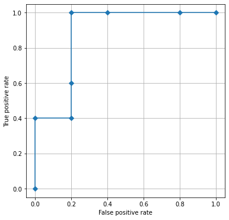
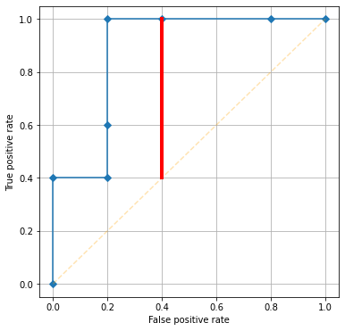

# Построенние ROC-кривой

Авторы:

- **Суворов Александр Юрьевич**, [ORCID](https://orcid.org/0000-0002-2224-0019)

## Матрица ошибок

Представим себе, что у нас есть 2 неких условных класса: А и В, или здоровые и больные, или 0 и 1. Более того, представим себе что принадлежность к классу довольно объективна. Например, наличие/отсутствие тромбоза глубоких вен голени. 

У нас есть группа пациентов, которых мы пытаемся разделить на группы в зависимости от принадлежноси к классу. 

Когда мы всесторонне обследуем пациентов и находим тромбоз - пациент попадает в класс 1. Если тромбоза нет, пациент попадает в класс 0. 

Далее представим, что мы придумали новый скрининговый метод, позволяющий за 10 секунд с помощью смартфона выяить наличие/отсутствие тромбоза у пациента. 

Нам нужно подтвердить, что наш метод:

- работает (способен хоть как-то отличить здоровых от больных);
- работает неплохо (демонстрирует низкое количество ложноположительных и ложноотрицательных результатов)

Наша задача - протестировать, как новый метод справляется с классификацией. Для этого мы проверяем, насколько хорошо метод диагностирует тромбоз (дает истинноположительный результат) и насколько хорошо он исключает тромбоз у пациентов при его отсутствии (истинноотрицательный результат). 

В итоге, мы можем составить вот такую таблицу сопряженности, которая получила название *матрица ошибок* или *confusion matrix/ error matrix*. 

|                         | Предсказанные значения 1           | Предсказанные значения 0            |
| ----------------------- | ---------------------------------- | ----------------------------------- |
| **Реальные значения 1** | Истинноположительные значения (TP) | Ложноотрицательные значения (FN)    |
| **Реальные значения 0** | Ложноположительные значения (FP)   | Истинно отрицательные значения (TN) |

Если новый тест хорошо справляется и с задачей подтверждения диагноза, и с задачей исключения диагноза, значения TP и TN будут высокими, а FP и FN - низкими. Такие тесты практически идеальны. 

Если тест хорошо подтверждает диагноз, но плохо исключает, то высокими будут значения TP и FN, а низкими - TN и FP.

Тесты, которые хорошо исключают диагноз, но плохо подтверждают, имеют высокие показатели TN и FP, и низкие TP и FN.

С матрицей ошибок связан целый ряд параметров, которые мы можем узнать о новом тесте:

- Чувствительность (sensitivity, recall, true positive rate (TPR)):

$TPR = \frac {\mathrm{TP}} {\mathrm{TP}+\mathrm{FN}}= 1 - \mathrm{FNR}$

- Специфичность (specificity, selectivity, true negative rate (TNR)):

$TNR = \frac {\mathrm{TN}} {\mathrm{TN} + \mathrm{FP}} = 1 - \mathrm{FPR}$

- Положительная прогностическая ценность (precision, positive predictive value):

$PPV = \frac {\mathrm{TP}} {\mathrm{TP} + \mathrm{FP}} = 1 - \mathrm{FDR}$

- Отрицательная прогностическая ценность (negative predictive value): 

$NPV = \frac {\mathrm{TN}} {\mathrm{TN} + \mathrm{FN}} = 1 - \mathrm{FOR}$

- Частота ложноотрицательных значений (false negative rate):

$FNR = \frac {\mathrm{FN}} {\mathrm{FN} + \mathrm{TP}} = 1 - \mathrm{TPR}$

- Частота ложноположительных значений (false positive rate): 

$FPR = \frac {\mathrm{FP}} {\mathrm{FP} + \mathrm{TN}} = 1 - \mathrm{TNR}$

- false discovery rate (FDR): 

$FDR = \frac {\mathrm{FP}} {\mathrm{FP} + \mathrm{TP}} = 1 - \mathrm{PPV}$

- false omission rate (FOR): 

$FOR = \frac {\mathrm{FN}} {\mathrm{FN} + \mathrm{TN}} = 1 - \mathrm{NPV}$

- Положительное отношение правдоподобия (positive likelihood ratio (LR+)): 

$LR+ = \frac {\mathrm{TPR}} {\mathrm{FPR}}$

- Отрицательное отношение правдоподобия (negative likelihood ratio (LR-)): 

$LR- = \frac {\mathrm{FNR}} {\mathrm{TNR}}$

- Точность (accuracy): 

$ACC = \frac {\mathrm{TP} + \mathrm{TN}} {\mathrm{TP} + \mathrm{TN} + \mathrm{FP} + \mathrm{FN}}$

- скорректированная точность (balanced accuracy (BA)): 

$BA = \frac {TPR + TNR}{2}$

- F1 score - гармоническое среднее между PPV и TPR: 

$F_1 = 2 \times \frac {\mathrm{PPV} \times \mathrm{TPR}} {\mathrm{PPV} + \mathrm{TPR}} = \frac {2 \mathrm{TP}} {2 \mathrm{TP} + \mathrm{FP} + \mathrm{FN}}$

- Коэффициент корреляции Мэтью (Matthews correlation coefficient (MCC)): 

$MCC = \frac{ \mathrm{TP} \times \mathrm{TN} - \mathrm{FP} \times \mathrm{FN} } {\sqrt{ (\mathrm{TP}+\mathrm{FP}) ( \mathrm{TP} + \mathrm{FN} ) ( \mathrm{TN} + \mathrm{FP} ) ( \mathrm{TN} + \mathrm{FN} ) }}$

Данные показатели мы часто используем для:

- оценки качеств диагностического теста при объективной принадлежности к классам (как в условиях выше);

- оценки качеств нового диагностичексого теста по отношению к "золотому стандарту" (при этом мы принимаем гипотезу о том, что "золотой стандарт" является объективным классификатором).

С матрицей ошибок напрямую связана т.н. *кривая ошибок* или ROC-кривая (receiver operating characteristic). 

## Построение ROC-кривой

ROC-анализ позволяет оценить качество бинарной классификации, а также определить оптимальный порог разделения некоего массива значений на классы (напрмер, поределить пороговые значения диагностических тестов и т.д.).

Попробуем построить такую кривую и разобраться, как работает этот метод. 

Представим, для простоты, что у нас имеется некое заболевание, которое мы выявляем у 10 пациентов. Мы заранее знаем болен пациент (класс 1) или здоров (класс 0). Мы делаем забор крови и исследуем у каждого пациента величину некоего маркёра V. 

Таким образом, каждый пациент принадлежит к определенному классу (массив **classes**) и имеет значение маркера V (массив **V values**):

| Номер пациента | 1    | 2    | 3    | 4    | 5    | 6    | 7    | 8    | 9    | 10   |
| -------------- | ---- | ---- | ---- | ---- | ---- | ---- | ---- | ---- | ---- | ---- |
| V values       | 3    | 1    | 3    | 5    | 4    | 5    | 9    | 8    | 9    | 6    |
| Classes        | 0    | 0    | 0    | 1    | 0    | 1    | 1    | 0    | 1    | 1    |

Отсортируем оба массива так, чтобы набор вещественных значений имел порядок по возрастанию:

**Выражение 1. Отсортированный вещественный массив и соответствующие ему значения классов.**

$\begin{cases} V\ values:[9, 9, 8, 6, 5, 5, 4, 3, 3, 1] \\ classes:\ \ \ [1, 1, 0, 1, 1, 1, 0, 0, 0, 0] \end{cases}$

ROC-кривая представляет собой кривую на координатной плоскости, где осью абсцисс (х) являются FPR из уравнений выше, а по оси ординат TPR. 

Откуда же нам взять значения FPR и TPR?

Проведем следующую манипуляцию. Оценим, какие *уникальные* значения есть в массиве **V values**: $\{1,3,4,5,6,8,9\}$.

Отсортируем теперь *уникальные* значения из массива по возрастанию $\{9,8,6,5,4,3,1\}$. Каждое уникальное значение $i$ из такого массива должно стать *пороговым*: значения выше, или равные порогу $i$ становятся классом 1, значения ниже порога $i$ становятся классом 0 (см. таблицу 1). После этого мы в подставляем *бинарные значения новых классов с учетом порогов* в отсортированный массив **V values** из выражения 1:

**Таблица 1. Введение порогов с сортировкой.**

| Порог $i$         | Отсортированные по убыванию *уникальные* значения массива V values | Отсортированные по убыванию *все имеющиеся* значения массива V values |
| -------------- | ------------------------------------------------------------ | ------------------------------------------------------- |
| Без порога     | [9,8,6,5,4,3,1]                                              | [9, 9, 8, 6, 5, 5, 4, 3, 3, 1]                          |
| Порог 9 и выше | [1,0,0,0,0,0,0]                                              | [1,1,0, 0,0,0,0,0,0,0]                                  |
| Порог 8 и выше | [1,1,0,0,0,0,0]                                              | [1, 1, 1, 0,0,0,0,0,0,0]                                |
| Порог 6 и выше | [1,1,1,0,0,0,0]                                              | [1,1,1,1, 0,0,0,0,0,0]                                  |
| ...            |                                                              |                                                         |
| Порог 4 и выше | [1,1,1,1,1,0,0]                                              | [1,1,1,1,1,1,1, 0,0,0]                                  |
| ...            |                                                              |                                                         |


Теперь для каждого порога $i$ заменим в **Выражении 1** значения массива **values** на соответствующие значения из крайнего правого столбца **таблицы 1**. 

Например, для порога "**9 и выше**":


| Номер пациента              | 7    | 9    | 8    | 10   | 6    | 4    | 5    | 1    | 3    | 2    |
| --------------------------- | ---- | ---- | ---- | ---- | ---- | ---- | ---- | ---- | ---- | ---- |
| V values свыше или равное 9 | 1    | 1    | 0    | 0    | 0    | 0    | 0    | 0    | 0    | 0    |
| Classes                     | 1    | 1    | 0    | 1    | 1    | 1    | 0    | 0    | 0    | 0    |


Когда значения реальных классов и V-values совпадают, мы имеем истинноположительные значения (у пациентов 7 и 9). Там, где оба значения равны 0 - истинноотрицательные значения (у пациентов 8,5,1,3,2). Если значение реального класса равно 1, а V-values - 0, данное значение ложноотрицательное. При значении реального класса 0, а V-values - 1, данное значение ложноположительное. Истинность и ложность, как мы заметили, высказывается в отношении V-values (аналогично примеру с новым диагностическим тестом в разделе про матрицу ошибок).

Составим *матрицу ошибок* для порога 9 и выше, а затем рассчитать FPR и TPR:

|                                    | V values: значения 1 (предсказанные)   | V values: значения 0 (предсказанные)    |
| ---------------------------------- | -------------------------------------- | --------------------------------------- |
| **Classes: значения 1**(реальные)  | Истинноположительные значения (TP) = 2 | Ложноотрицательные значения (FN) = 3    |
| **Classes:  значения 0**(реальные) | Ложноположительные значения (FP) = 0   | Истинно отрицательные значения (TN) = 5 |

Отсюда вычисляем:

$TPR = \frac {2}{2+3} = 0,4$

$FPR = \frac {0}{0+5} = 0$

Далее повторяем данную операцию для каждого порога. 

В итоге мы получим значения FPR и TPR, являющиеся координатами  для каждого порога для построения ROC-кривой, см. Таблицу 2. Наша задача - построить точки координат на плоскости и соединить их линией. Мы всегда начинаем из точки с координатами (0,0), затем соединяем линией точки от наибольшего порога к наименьшему, и приходим в точку с координатами (1,1): 

**Таблица 2. Координаты для построения ROC-кривой.**

|                 | FPR (ось X) | TPR (ось Y) |
| --------------- | ----------- | ----------- |
| Начальная точка | 0           | 0           |
| Порог 9 и выше  | 0           | 0,4         |
| Порог 8 и выше  | 0,2         | 0,4         |
| Порог 6 и выше  | 0,2         | 0,6         |
| Порог 5 и выше  | 0,2         | 1         |
| Порог 4 и выше  | 0,4         | 1           |
| Порог 3 и выше  | 0,8         | 1           |
| Порог 1 и выше  | 1         | 1           |
| Конечная точка  | 1           | 1           |

Получаем график:



Вот мы и построили нашу первую ROC-кривую!

## Чувствительность и специфичность 

Важно понимать, что у каждой точки на кривой будет свой показатель чувствительности и специфичности, в зависимости от того, какой порог мы возьмем. 

Например, если нам нужна чувствительность 0,6, то ей соответствует порог со значением "**6 и выше**" в **Таблице 2**, специфичность для такого порога составит 1 - FPR = 1 - 0.2 = 0.8. 

## Площадь под кривой (area under curve, AUC)

Существует несколько способов рассчитать площадь под кривой. 

Самый простой - рассмотреть полученную фигуру, как многоугольник несколько многоугольников, сложенных вместе.

Для нашей кривой мы банально можем рассчитать количество  количество "квадратов" координатной сетки (цена деления 0,2), находящихся под ROC-кривой и разделить на общее количество квадратов графика:

$AUC = \frac{22}{25} = 0.88$

Однако при больших массивах данных ручной подсчет лишён всякого смысла. 

Одним из решений является интегрирование по [методу трапеций](https://en.wikipedia.org/wiki/Trapezoidal_rule). 

Имея рассчитанные массивы TPR и FPR, мы можем очень быстро рассчитать по этому методу AUC:

```python
import numpy as np

fpr = np.array([0, 0, 0.2, 0.2, 0.2, 0.4, 0.8, 1])
tpr = np.array([0, 0.4, 0.4, 0.6, 1, 1, 1, 1])

print(np.trapz(tpr, fpr))

>>> 0.88
```

Также возможно рассчитать AUC с помощью метода Римана[^1], [^2]

[^1]: [Wikipedia](https://en.wikipedia.org/wiki/Riemann_sum)
[^2]: [Сумма Римана с кодом для python](https://personal.math.ubc.ca/~pwalls/math-python/integration/riemann-sums/)

## Оптимальный порог разделения с помощью индекса Йоудена

Существует несколько разных способов определить оптимальный порог разделения на классы вектора **V values**.

Одним из них является расчет индекса Йоудена (Youden's J statistic) *для каждой точки*, по которым мы строили ROC-кривую.

Индекса Йоудена легко рассчитать по формуле 

$J = TPR + TNR - 1 = TPR + (1 - FPR) - 1 = TPR - FPR$

Графически на координатной сетке Youden's J statistic выглядит следующим образом для порога 4 и выше:



Порог с наибольшим индексом Йоудена может быть использован при поиске оптимального разделения значений массива **V values** для создания бинарных классов. 

Рассчитаем для нашей ROC-кривой индексы Йоудена:

**Таблица 3. Индексы Йоудена для построенной ROC-кривой.**

|                 | FPR (ось X) | TPR (ось Y) | Youden's J |
| --------------- | ----------- | ----------- | ---------- |
| Начальная точка | 0           | 0           | 0          |
| Порог 9 и выше  | 0           | 0,4         | 0,4        |
| Порог 8 и выше  | 0,2         | 0,4         | 0,2        |
| Порог 6 и выше  | 0,2         | 0,6         | 0,4        |
| Порог 5 и выше  | 0,2         | 1           | 0,8        |
| Порог 4 и выше  | 0,4         | 1           | 0,6        |
| Порог 3 и выше  | 0,8         | 1           | 0,2        |
| Порог 1 и выше  | 1         | 1           | 0        |
| Конечная точка  | 1           | 1           | 0          |

Таким образом, оптимальным порогом разделения для массива **V values** является порог 5 и выше. 

В многочисленных статьях обычно указывают некий показатель AUC,  а также TPR, TNR, PPV, NPV для него, и может сложиться впечатление, что это показатели связаны со всей кривой. Однако это неверно! Чаще всего, если не сказано иначе, данные характеристики указываются как раз для точки с наивысшим индексом Йоудена. 

### Итоги

Таким образом, мы построили ROC-кривую для небольшого массива, поняли, как рассчитать площадь под ней разными способами, а также научились определять теоретический наилучший порог разделения массива на классы. 

