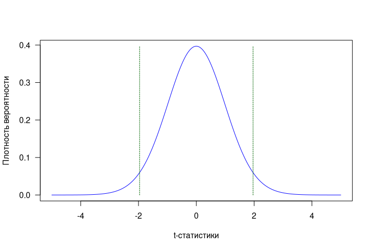
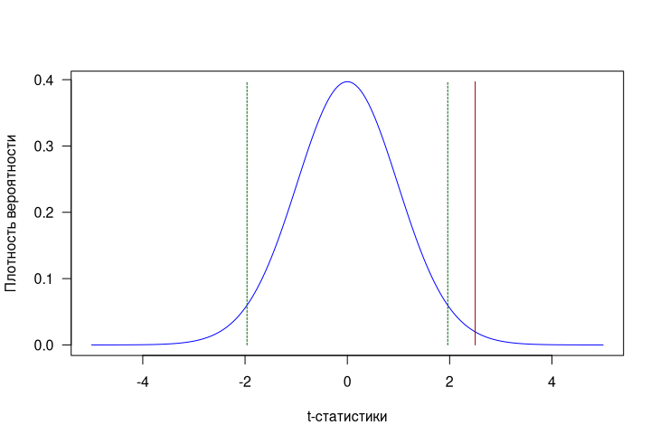
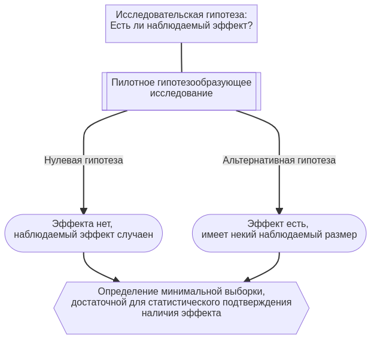
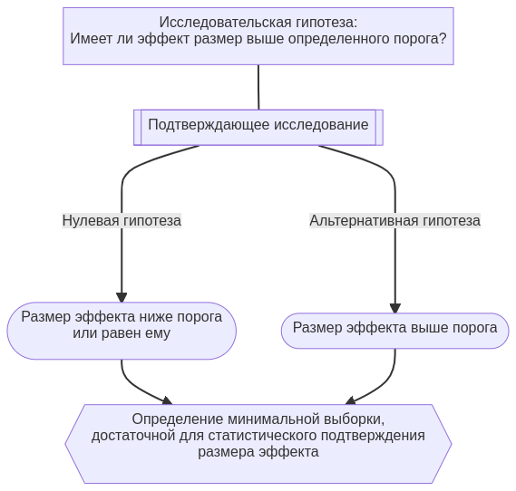
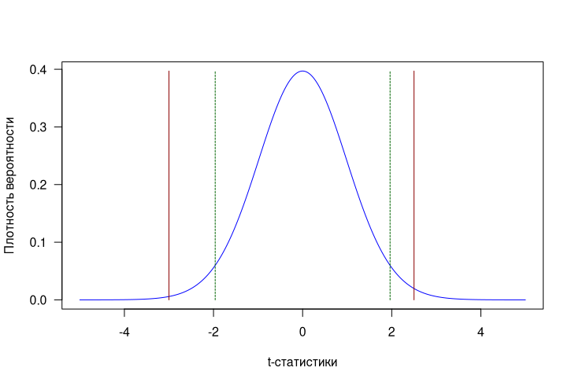
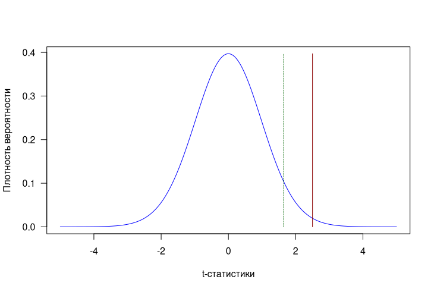
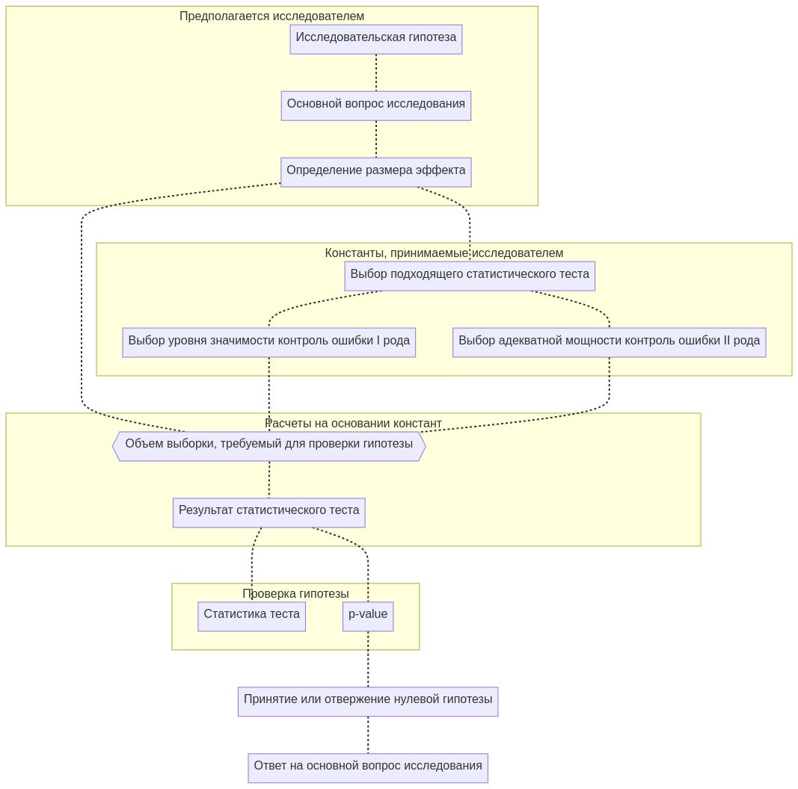
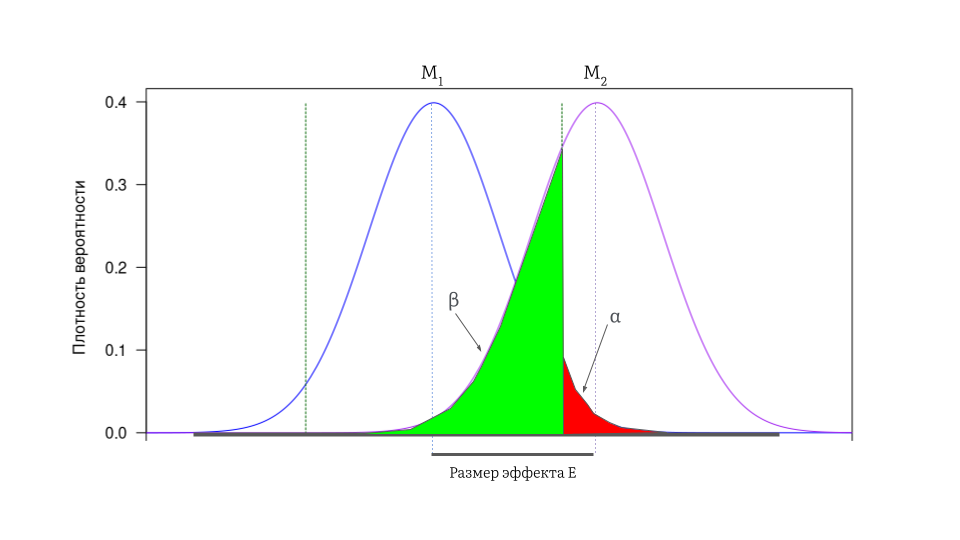
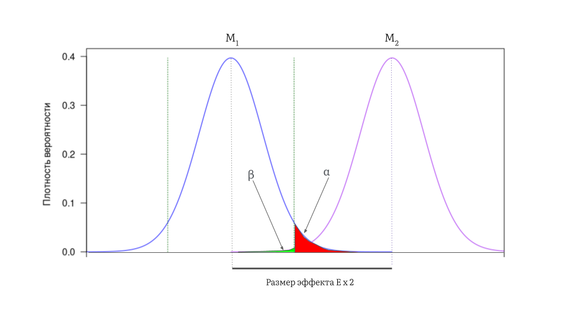
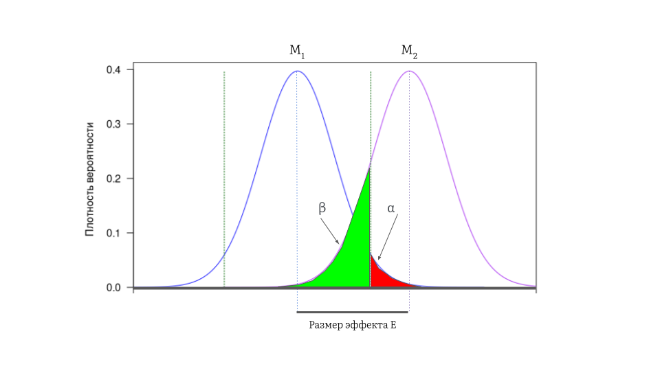

# Проверка статистических гипотез

> Составитель: Суворов Александр Юрьевич

## Авторы

- **Суворов Александр Юрьевич**, [ORCID](https://orcid.org/0000-0002-2224-0019)

- **Буланов Николай Михайлович**, [ORCID](https://orcid.org/0000-0002-3989-2590)

## Оглавление

- [Проверка статистических гипотез](#проверка-статистических-гипотез)
  - [Авторы](#авторы)
  - [Оглавление](#оглавление)
  - [Концепция планируемых исследований](#концепция-планируемых-исследований)
  - [Исследовательские и статистические гипотезы](#исследовательские-и-статистические-гипотезы)
  - [Статистические тесты](#статистические-тесты)
  - [Размер эффекта](#размер-эффекта)
    - [Как оценивается размер эффекта?](#как-оценивается-размер-эффекта)
  - [Формирование исследовательских гипотез и концепция размера эффекта](#формирование-исследовательских-гипотез-и-концепция-размера-эффекта)
  - [Односторонние и двусторонние статистические тесты](#односторонние-и-двусторонние-статистические-тесты)
    - [Двусторонние тесты](#двусторонние-тесты)
    - [Односторонние тесты](#односторонние-тесты)
  - [Ошибки I и II рода](#ошибки-i-и-ii-рода)
  - [Объем требуемой выборки в концепции проверки статистических гипотез](#объем-требуемой-выборки-в-концепции-проверки-статистических-гипотез)

## Концепция планируемых исследований

В медицинской науке одним из способов проведения экспериментов является концепция планируемых исследований.

При таком подходе задаются четкие правила проведения исследования с обозначением ряда жестких рамочных условий:

- цель исследования с четко поставленным *вопросом исследования*;

- четко прописанные *задачи*, с помощью которых будет достигнута цель;

- одна или несколько изначальных исседовательских гипотез, требующих подтверждения в рамках вопроса исследования (что и является вопросом исследования);

- дизайн, направленный на максимальную реализацию цели исследования и снижение вероятности возникновения ошибок, при этом минимизирующий вероятные смещения;

- дизайн должен быть направлен на получения достоверных и воспроизводимых результатов;

- четкие критерии включения и невключения в исследования;

- пошаговое описание методов анализа, направленного на получение выводов по каждой задаче исследования и по поставленному вопросу исследования.

Таким образом, при планировании исследования моделируется некое идеальное состояние, которое позволяет исследователям ответить на вопрос исследования и достичь цели. Планируемые исследования позволяют проводить достаточно компактные по количеству участников и по времени исследования. 

Несколько противоположной концепцией могут являться обсервационные поисковые исследования, однако и в них существуют цель, задачи и исследуемая популяция (обычно довольно широкая). Главным же отличием от планируемых исследований является не подтверждение изначальных исследовательских гипотез о взаимодействии факторов, а поиск таких взаимодействий. 

за планируемыми исследованиями всегда стоит основной его вопрос, который требует ответа. В обсервационных же исследованиях во главу угла ставится поиск любых важных с точки зрения цели исследования взаимодействий внутри исследуемой популяции, основной вопрос исследования, требующий подтверждения, обычно отсутствует. 

Настоящая статья фокусируется на планируемых исследованиях для понимания  процесса выстраивания связи между вопросом исследования и ответом на него с точки зрения методологии проведения исследований. 

## Исследовательские и статистические гипотезы

Началом любого исследования и эксперимента является *гипотеза* или научное предположение. Исследователи выдвигают такие предположения и пытаются их доказать иили опровергнуть. например, о том, что плохая экология региона имеет некое влияние на здоровье жителей. Или о том, что курение может увеличивать риск сердечно-сосудистых заболеваний. Такие предположения получили названия *исследовательские гипотезы*.

Им противопоставляются *статистические гипотезы*, являющиеся переформулировкой исследовательских гипотез таким образом, чтобы их можно было рассматривать с помощью статистических методов и концепции дизайна экспериментов. 

*Статистическая гипотеза* представляет собой некое суждение о параметрах, описывающих статистическую популяцию (но не выборку из нее). В свою очередь, *статистическая популяция* представляет собой группу однородных элементов, представляющих интерес в рамках настоящего исследования или эксперимента. 

*Нулевая гипотеза* утверждает о том, что наблюдаемые эффекты, явления или взаимодействия происходят в силу случайности. Нулевая гипотеза традиционно обозначается, как $H_0$.  *Альтернативная гипотеза*, наоборот, утверждает, что наблюдаемые явления неслучайны. Альтернативная гипотеза традиционно обозначается, как $H_1$ или $H_A$. 

Например, в небольшом исследовании оцениваются различия 2-х средних значений ($\mu_1$ и $\mu_2$) по некоему вещественному (числовому) признаку - по уровню общего холестерина плазмы. Исследовательская гипотеза может состоять в том, что группы как различаются, так и не различаются. 

Нулевая же гипотеза будет утверждать, что истинных различий между средними нет, а наблюдаемые различия случайны:

- $H_0: \mu_1 = \mu_2$

Альтернативной гипотезой является утверждение о том, что истинные различия между средними существуют:

- $H_1: \mu_1 \neq \mu_2$

Нулевая и альтернативная гипотезы являются *взаимоисключающими*, то есть, если верна $H_0$, то неверна $H_1$ и наоборот. Таким образом, для того, чтобы подтвердить альтернативную гипотезу, нам нужно отвергнуть нулевую. 

## Статистические тесты

Статистический тест - метод статистического доказательства (или построения статистического вывода) о том, возможно ли отвергнуть нулевую гипотезу. Если $H_0$ отвергается, делается статистический вывод о том, что верна альтернативная гипотеза   $H_1$. 

Каждый статистический тест является математической функцией, вычисляющей т.н. *тестовую статистику*. Данная статистика показывает, насколько близко наблюдаемая величина соответствует ожидаемому распределению величин, при условии, что верна нулевая гипотеза. Чем больше такая статистика, тем больше несоответствие между наблюдаемым и ожидаемым распределениями. 

Совокупность тестовых статистик теста подчиняется определенному закону распределения. Например, t-тест вычисляет t-статистики, подчиняющиеся t-распределению.  Для того, чтобы отвергнуть нулевую гипотезу, нужен некий *порог среди распределения тестовых статистик*. Такая величина пороговой тестовой статистики получила название *критическое значение*, а соответствующая ей вероятность в распределении тестовых статистик - *уровень значимости*.

Уровень значимости, который обозначается, как $\alpha$, является вероятностью того, что при такой тестовой статистике нулевая гипотеза будет отвергнута при условии, если она верна. Т.е., вероятность того, что верная нулевая гипотеза будет ошибочно отвергнута.  Такая вероятность также получила название *ошибка I рода* (о ней мы поговорим чуть позже). Величину $\alpha$ и соответствующее ей критическое значение статистического теста изначально декларируют исследователи для того, чтобы заранее определить вероятность ошибочного отвержения нулевой гипотезы. Чем меньше уровень значимости, тем более низкая вероятность отвергнуть нулевую гипотезу в случае, если она является верной.

После вычисления результата статистического теста в виде некоей наблюдаемой тестовой статистики, исследователи получают соответствующую ей *вероятность получения таких же или более экстремальных результатов теста (по сравнению с наблюдаемыми), в случае, если нулевая гипотеза верна*. Такая вероятность получила название $p-value\ (p)$. Малые значения р-value говорят о том, что при условии верной нулевой гипотезы, вероятность получения таких же или более экстремальных результатов крайне мала. Следовательно, имеется высокая вероятность того, что нулевая гипотеза неверна. 

Если $p \le \alpha$, статистика теста равна или превышает критическое значение, а сам результат считается статистически значимым. 

**Рисунок 1**. T-распределение (для 50 степеней свободы)

**- на графике указаны критические значения 1.962337 и -1.962337, соответствующие двустороннему уровню значимости $\alpha$ = 0,05.* 

**Рисунок 2**. T-статистика = 2,5, превышающая критическое значение 1.962337

**- на графике красной линией показана t-статистика = 2,5, превышающая критическое значение 1.962337, $p-value$ = 0.0126 при двустороннем t-тесте* 

## Размер эффекта

Исследовательские гипотезы наиболее часто связаны с поиском различий или ассоциаций между некими показателями. 

Например, в одном исследовании сравнивали доли некоего терапевтического эффекта в двух группах, и они составили 10% и 80% соответственно. Мы видим, что доли различаются, и довольно существенно, разница составляет 70%. В другом исследовании аналогичные доли составили 45% и 55%. Мы снова видим, что доли различаются, однако уже не так сильно, разница всего 10%. Еще в одном исследовании эффективность терапии в  двух группах составила 75% и 80%. Доли различаются, но разница очень невелика - всего 5%.  

Другой пример связан с новым антигипертензивными препаратами. Новый препарат Х снижает систолическое артериальное давление (САД) в среднем на 15 мм рт. ст. Препарат Y также снижает САД, но в среднем на 8 мм рт.ст. Наконец, препарат Z снижает САД, но всего в среднем на 1 мм рт.ст. При использовании традиционной антигипертензивной терапии среднее снижение АД составило 1 мм рт ст. 

Во всех примерах мы видим, что некий эффект есть, но он *разный*, где-то больший, где-то меньший. 

*Размер эффекта* - довольно широкое статистическое понятие, обозначающее некую статистику или показатель, показывающий величину различий или ассоциации между распределениями. Размер эффекта в медицине крайне важен, т.к. он привязан не только к статистике, но и к клинической значимости наблюдаемых в исследовании результатов. Например, мы используем среднее снижение САД в качестве размера эффекта. Среднее снижение САД в 1 мм рт.ст., скорее всего, не является клинически значимым -  для пациента препарат Z не будет лучше традиционной терапии, таким образом, с терапевтических позициий его назначение бессмысленно. Слишком большой размер эффекта (препарат X) может быть ассоциирован с развитием осложнений на фоне сильной гипотензивной реакции. Препарат Y, вероятно, является оптимальным выбором среди новых препаратов - он имеет достаточный, но при этом довольно умеренный антигипертензивный эффект. 

Крайне важно понимать, что, проверяя статистические гипотезы, мы пытаемся статистически зафиксировать определенный размер эффекта. Истинная разница между средними редко бывает равна 0. при этом разница может быть небольшой и клинически незначимой, в любую сторону. С другой стороны, при проверке статистических гипотез необходимо четко ввести критерий наличия или отсутствия (или отсутствия клинического смысла) у того или иного эффекта. 

Например, в примере с антигипертензивными препаратами возможно определить размер эффекта, как отсутствующий при среднем снижении САД на 2 мм рт. ст. и менее, умеренный - при среднем снижении на 3-10 мм рт. ст., сильный - при среднем снижении САД выше 10 мм рт. ст. В качестве проверяемой исследовательской гипотезы мы хотим выяснить, достигнет ли среднее снижение САД с препараты X, Y, Z хотя бы умеренного размера эффекта. 

### Как оценивается размер эффекта?

Огромный вклад в концепцию размера эффекта внес психолог и статистик Jacob Cohen. Сегодня существует большое количество статистик, позволяющих оценить размер эффекта, фактически при проверке любых гипотез.

Выделяют стандартизованные методы оценки размера эффекта и нестандартизованные. Стандартизованные способы позволяют оценивать эффект для переменных с разной размерностью (например, оценка коэффициента корреляции для переменных, измеряемых в разных единицах), для оценки совокупных результатов  разных исследований (мета анализ и мета регрессия), при сравнении результатов исследований с использованием разных метрик переменных (например, при использовании г/л в одном исследовании и ммоль/л в другом). 

Также выделяют следующие методы оценки размера эффекта:

- размер эффекта, оценивающий ассоциацию между распределениями числовых переменных, или насколько распределение одной переменной вносит вклад в распределение другой переменной (коэффициент корреляции, коэффициент детерминации и др.)

- размер эффекта, оценивающий разницу между статистиками (Cohen\`s d, Glass\` $\Delta$, разница рисков и др.)

- размер эффекта, оценивающий ассоциацию между категориальными переменными (Cohen's h, отношение шансов, относительный риск и др.)

**Таблица 1. Избранные методы оценки размера эффекта, оценивающие разницу между статистиками**

| Название                                      | Описание                                                                                    | Стандартизованный метод | Формула                                |
| --------------------------------------------- | ------------------------------------------------------------------------------------------- | ----------------------- | -------------------------------------- |
| Среднее                                       | Среднее значение                                                                            | Нет                     | $\mu$                                  |
| Дельта средних                                | Дельта между 2-мя средними                                                                  | Нет                     | $\Delta = \mu_1 - \mu_2$               |
| Отношение средних                             | Ratio of means, ROM. Отношение между 2-мя средними                                          | Да                      | $RoM = \frac{\mu_1}{\mu_2} $           |
| Cohen's d (стандартизованная разница средних) | Разница между 2-мя средними, отнесенная ко взвешенному стандартному отклонению.             | Да                      | $d = \frac{\mu_1 - \mu_2}{s_{pooled}}$ |
| Cohen's d для парных выборок                  | Дополнительно учитывает величину корреляции между парными выборками                         | Да                      | $d = \frac{d'}{\sqrt{1 - r}}$          |
| Glass\` $\Delta$                              | Разница между 2-мя средними, отнесенная к  стандартному отклонению во второй группе         | Да                      | $\Delta = \frac{\mu_1 - \mu_2}{s_2}$   |
| Разница рисков                                | Risk difference, RD. Разница между долями ($p_1, p_2$) развития эффекта между 2-мя группами | Да                      | $RD = p_1 - p_2$                       |

**Таблица 2. Избранные методы оценки размера эффекта, оценивающие ассоциацию между распределениями числовых переменных**

| Название                       | Описание                                                                       | Стандартизованный метод | Формула                                                                                                                                      |
| ------------------------------ | ------------------------------------------------------------------------------ | ----------------------- | -------------------------------------------------------------------------------------------------------------------------------------------- |
| Коэффициент корреляции Пирсона | Оценивает корреляцию между 2-мя переменными                                    | Да                      | $r_{xy} =\frac{\sum ^n _{i=1}(x_i - \bar{x})(y_i - \bar{y})}{\sqrt{\sum ^n _{i=1}(x_i - \bar{x})^2} \sqrt{\sum ^n _{i=1}(y_i - \bar{y})^2}}$ |
| Коэффициент детерминации       | Отражает пропорцию вариации, которую вносит независимая переменная в зависимую | Да                      | $R^2 = r^2$                                                                                                                                  |

**Таблица 3а. Избранные методы оценки размера эффекта, оценивающие ассоциацию между категориальными переменными**

| Название           | Описание                                                                                                                                                                            | Стандартизованный метод | Формула                                                |
| ------------------ | ----------------------------------------------------------------------------------------------------------------------------------------------------------------------------------- | ----------------------- | ------------------------------------------------------ |
| Cohen's h          | Мера оценки дистанции между 2-мя пропорциями или вероятностями                                                                                                                      | Да                      | $h = 2 \times (arcsin \sqrt{p_1} - arcsin \sqrt{p_2})$ |
| Отношение шансов   | Odds ratio, OR. Отражает шанс (N к 1) развития болезни в основной группе (exposed) по сравнению с референсной группой (not exposed), см. таб. 3б.                                   | Да                      | $OR = \frac{D_E/H_E}{D_N/H_N}$                         |
| Относительный риск | Relative risk (risk ratio), RR. Отражает отношение заболеваемостей за определенное время в основной группе (exposed) по сравнению с референсной группой (not exposed), см. таб. 3б. | Да                      | $RR = \frac{D_E/T_E}{D_N/T_N}$                         |

**Таблица 3б. Четырехпольная таблица для расчета риска**

|             | Deseased | Healthy | Total             |
| ----------- | -------- | ------- | ----------------- |
| Not exposed | $D_N$    | $H_N$   | $D_N + H_N = T_N$ |
| Exposed     | $D_E$    | $H_E$   | $D_E + H_E = T_E$ |

## Формирование исследовательских гипотез и концепция размера эффекта

Размеру эффекта отдается ключевая роль при формировании исследовательских и статистических гипотез. 

Первоначально исследователи ставят вопрос о том, случаен ли наблюдаемый ими эффект? Например, различаются лои в действительности уровни общего холестерина на фоне лечения новым препаратом и в контрольной группе? Наблюдаемые различия могут быть обусловлены случайностью. Для того, чтобы проверить, существует ли эффект в действительности, проводят т.н. поисковые и пилотные исследования, основной целью котроых является определение наличия эффекта в принципе. Такие исследования получили названия *гипотезообразующих*. Безусловно, если удалось зафиксировать эффект, в пилотных исследованиях мы смотрим на его наблюдаемый или гипотетический размер. Пилотные исследования часто довольно компактны и позволяют лишь ответить на вопрос наличия/отсутствия эффекта, но не достоверно определить его размер. 

**Диаграмма 1. Создание гипотезообразующих исследований**

Следующий этап исследований после пилотных, получил название *подтверждающих* исследований, и направлен на то, чтобы зафиксировать эффект определенного размера. 

Например, нами было установлено, что курение среди мужчин, проживающих в городах, в возрасте 35-45 лет увеличивает риск развития сердечно -сосудистых заболеваний за 10 лет, RR = X.  Перед нами стоит вопрос о влиянии курения на аналогичную группу мужчин, проживающих в сельской местности. Для того, чтобы спланировать такое исследование, мы можем опираться на полученные ранее результаты в городской популяции и исходить из того, что нам нужно зафиксировать размер эффекта (RR) не менее X. Или, если по нашим исследовательским предположениям (!), эффект будет менее выражен, например, в $n$-раз, мы можем спланировать исследование так, чтобы засечь зафиксировать размер эффекта (RR) не менее X/$n$.

**Диаграмма 2. Создание подтверждающих исследований**

Использование размера эффекта позволяет каждый раз не проводить пилотные исследования, а также опираться на опыт из предшествующих исследований. 

Концепция размера эффекта требует от врачей понимания, что существуют порог размера эффекта, который они хотят зафиксировать статистически, т.к. такой порог является целесообразным с точки зрения медицины. И такой порог требует именно медицинского обоснования. Например, при исследовании нового препарата для снижения веса у пациентов с весом выше 200 кг было получено значимое снижение веса в течение 1 года, которое составило 1 кг. В результате эффект зафиксирован, он значим, но с точки зрения помощи пациентам такой эффект абсолютно лишен всякого смысла - в течение 1 года диетологи наверняка хотели бы наблюдать более интересную цифру по снижению веса. Вероятно, можно было бы ввести порог размера эффекта в 15 или 20 кг. 

## Односторонние и двусторонние статистические тесты

### Двусторонние тесты

Вернемся к примеру с антигипертензивной терапией. Существует новый препарат, назовем его TRT, который должен снижать САД, но как он себя покажет в эксперименте мы не знаем. Существует и традиционная антигипертензивная терапия, назовем ее CTRL. Если измерить среднее снижение САД в конце исследования, в группе TRT оно будет $\mu_{TRT}$, а в группе CTRL составит $\mu_{CTRL}$. 

Если мы ставим вопрос исследования, как "какая терапия более эффективна?", нулевая гипотеза декларирует, что $H_0: \mu_{TRT} = \mu_{CTRL}$. А вот альтернативная гипотеза $H_1: \mu_{TRT} \neq \mu_{CTRL}$ будет составлена из двух более простых:

$H_1 = \begin{cases} \mu_{TRT} > \mu_{CTRL} \\ \mu_{TRT} < \mu_{CTRL} \end{cases}$

То есть, мы рассматриваем альтернативные гипотезы и в случае *когда препарат TRT лучше*, чем CTRL, и, наоборот, когда TRT оказался бы *значимо хуже*. Тесты, используемые для такой проверки, получили название *двусторонние*. Если рассмотреть диаграмму распределения, например, t-статистики, мы увидим 2 зеркальных критических значения с разным знаком (при уровне значимости $\alpha$=0,05 для двустороннего теста критические значения будут -1.962 и 1.962). 

При двусторонних тестах общий уровень значимости разделяется пополам, и критические значения с каждой стороны соответствуют $\alpha/2$:

$\begin{cases} \alpha_{right} = \alpha / 2 \\ \alpha_{left} = \alpha / 2 \end{cases}$

При уровне значимости в 5%, нулевая гипотеза будет отвергнута, если t-статистика наблюдаемого эффекта превысит любое из двух критических значений (красные линии), соответствующеим 2,5% и 97,5%:

**График 3. Иллюстрация двустороннего теста (пояснения в тексте)**

Для чего исследователям двусторонние тесты? Т.к. мы не знаем истинного эффекта препарата TRT, двусторонний тест ответит на все варианты развития событий: TRT приблизительно одинаков по действию с CTRL, TRT лучше CTRL, TRT хуже CTRL. 

### Односторонние тесты

С другой стороны, если главный вопрос исследования "является ли TRT лучшей альтернативой CTRL?" наши гипотезы изменятся. Теперь нам важно зафиксировать только значимый размер эффекта, когда $\mu_{TRT} > \mu_{CTRL}$.

Таким образом, при формулировании нулевой и альтернативной гипотезы, получаем:

$\begin{cases} H_0 = \mu_{TRT} \leq \mu_{CTRL} \\ H_1 =\mu_{TRT} > \mu_{CTRL} \end{cases}$

Для проверки такой гипотезы используется *односторонний тест*, позволяющий не только зафиксировать *определенный размер эффекта*, но и его *направление*. 

В данном случае, нам важно проверить, превышает ли статистика теста критическое значение, расположенное на распределении справа:

 **График 4. Иллюстрация одностороннего теста (пояснения в тексте)**

**-на графике зеленая линия указано критическое значение 1.646377, соответствующее одностороннему уровню значимости alpha = 0,05. Для статистики t=2.5 (красная линия) p-value = 0.006*

При одностороннем тесте статистика соответствует избранному уровню значимости. 

## Ошибки I и II рода

Получение и интерпретация результатов исследований связано с 2-мя типами ошибок.

*Ошибка первого рода* (ложноположительный результат) — ситуация, когда отвергнута верная нулевая гипотеза. Принимается альтернативная гипотеза, которая неверна. 

*Ошибка второго рода*(ложноотрицательный результат) — ситуация, когда принята неверная нулевая гипотеза. Верная альтернативная гипотеза отвергается. 

| В статистической популяции | В ходе исследования | Результат проверки $H_0$         | Вероятность      |
| -------------------------- | ------------------- | -------------------------------- | ---------------- |
| $H_0$ верна                | $H_0$ принята       | Верное принятие                  | $P = 1 - \alpha$ |
| $H_0$ верна                | $H_0$ отвергнута    | Ложное отвержение, ошибка I рода | $P = \alpha$     |
| $H_0$ неверна              | $H_0$ принята       | Ложное принятие, ошибка II рода  | $P = \beta$      |
| $H_0$ неверна              | $H_0$ отвергнута    | Верное отвержение                | $P = 1 - \beta$  |

Для планирования эксперимента важно попытаться минимизировать ошибки I и II рода. 

Ошибка I рода, как мы уже говорили, и является уровнем значимости теста. Малая ошибка I рода позволяет с высокой вероятностью принять нулевую гипотезу, при условии, что она верна. 

В свою очередь, ошибка II рода позволяет с вероятностью $1 - \beta$ отвергнуть нулевую гипотезу, при условии, что она неверна. Такая вероятность получила название *мощность статистического теста*: $power = 1 - \beta$. В ряде медицинских исследований минимальная мощность соответствует не менее 80% (или максимальная ошибка II рода не выше 20%).

## Объем требуемой выборки в концепции проверки статистических гипотез

Последним элементом, необходимым для проверки статистических гипотез, является  минимальный объем требуемой выборки, необходимый для того, чтобы принять или отвергнуть нулевую гипотезу.

Таким образом, мы можем представить концепцию проверки статистических гипотез в виде следующей диаграммы:

**Диаграмма 3. Концепция проверки статистических гипотез**

Поставив вопрос исследования и предположив ожидаемый размер эффекта, исследователь:

- выбирает наиболее подходящий статистический тест, связанный с законом распределения размера эффекта в статистической популяции;

- устанавливает подходящий уровень значимости и мощность исследования;

- после этого рассчитывает требуемый объем выборки.

После этого можно переходить к выполнению статистического теста.

Каким образом исследователь может связать мощность исследования, уровень значимости, размер эффекта и объем выборки?

Представим себе, что мы пытаемся статистически зафиксировать размер эффекта Е с мощностью $1 - \beta$, значимостью $\alpha$ (график 5). Для этого нам потребуется объем выборки $n$. Заранее отметим, что уровень значимости теста должен оставаться фиксированным при любыом развитии событий. 

**График 5**

Если исследователь хочет оставить объем выборки неизменным, но при этом повысить мощность, самое простое решение - предположить, что мы будем наблюдать  больший размер эффекта, например, в 2 раза (или Е х 2). В таком случае, мощность действительно увеличится (график 6). 

**График 6**

Однако, в реальной жизни исследователь не может по собственному желанию наблюдать больший или меньший эффект, более того, предположение о размере эффекта есть лишь исследовательская гипотеза. В таком случае, размер эффекта также не должен увеличиться (график 7). При этом на графике 7 мощность выросла. Если приглядеться, распределения напоминают график 5, однако в данном случае был увеличен объем требуемой выборки.

**График 7**

Таким образом, при желании зафиксировать определенный размер эффекта со строгим уровнем значимости, единственной возможностью снизить риск ложного принятия нулевой гипотезы является увеличение объема требуемой выборки.